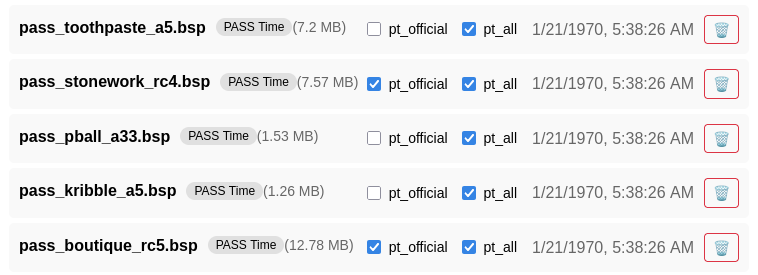

# Map Management

## Interface

We have created a web interface for map management that can be found at https://fastdl.pugs.tf.

## Upload and delete

Anyone can use this page to upload a map directly to the server but only authenticated admins can delete a map.

## FastDL

Once a map has been added through this interface, it immediately becomes available for all of our hosted TF2 servers. This map manager address also doubles as a fastdl server, so you only have to upload your map once and it will also be available to our servers over fastdl.

## Mapcycles

This management interface can also be used to add a map to (currently) one of two mapcycles. We have the "pt_official" and the "pt_all" mapcycles. To add a map to one of these mapcycles, you need to be an authenticated admin.

