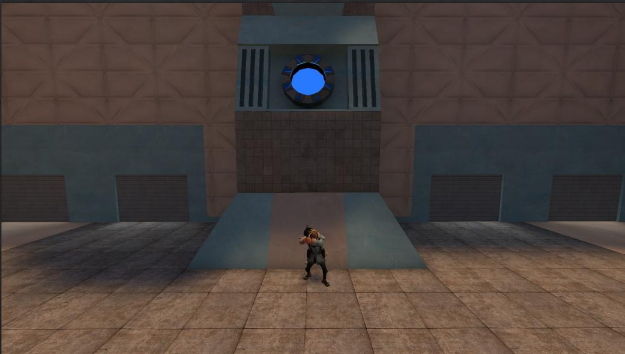
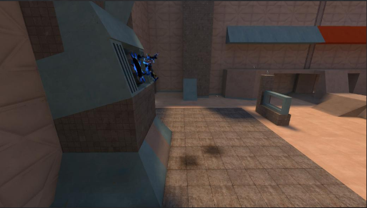
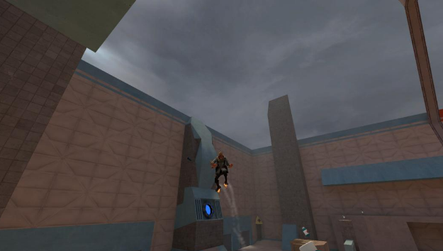
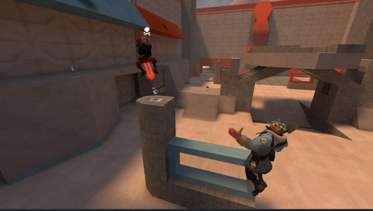
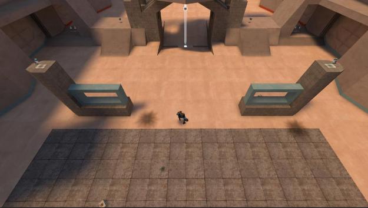
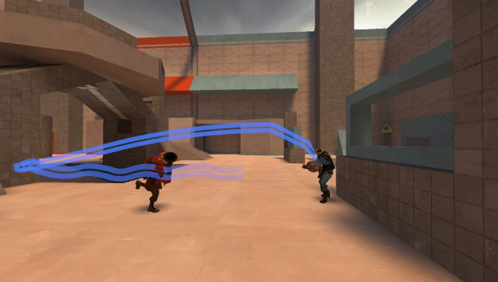
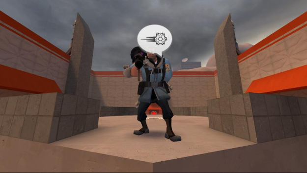
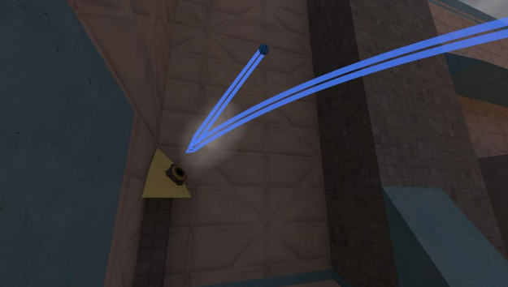

# Moose’s Basic 4v4 PT Defence Guide
<h2>All you’ll ever need to know!</h2>
<h5>(feat. Swag & Gevin)</h5>

## Defensive Roles

### Anchor/Inside Player

- Always at the goal while the other team is attacking.
- Usually the role for the best goal defender or the weakest chaser.
- You also should be able to make quick decisions after gaining possession.

- When jumping Infront of the goal, you only need to press spacebar and NOT crouch, so you can get the desired height to block the ball.
- You will learn the timing as you play, just remember to expect dribbles/passes if you have more than one defender alive. Attackers will have more confidence if you are by yourself.

### Chaser/Outside Player

- For the players who are best at jumping around and killing enemy attackers, and maybe not great at defending.
- Should have TWO of these at the beginning of the attack and ONE at the end.
- Basically just a DM role.

- If you have two chasers, you should only have ONE of them chasing the ball, and the other should be killing potential recipients.
- Also, if there is a medic they should be your highest priority target for the player that is not chasing the ball, as medics can heal their players to prolong the attack, outliving defenders.

### Floor Player

- Reserved for your Demo (Stoic & Pipes) or Medic.
- Their entire role here is to disrupt dribbling/passing while the attack is on going.
- Try and intercept or kill as much as possible.

- This is mainly a role influenced by “gamesense”, since you have to follow what is going to happen and not what is currently happening.
- What I recommend is to just try and predict what the player you are targeting is attempting to do, if it’s a soldier it is most likely a dribble/self bomb. Defending passes is up to your chasers.

### Baiting/Clearing

- Baiting is NEVER a good thing while the enemy has the ball
- However it is positive when your defender gains the possession, clearing the ball is very important to get it OUT of your half, keeping it there for too long leaves you vulnerable for attackers to regain possession.

- Clearing can win defence for your team, or even start a counter attack, depending on how you do it.
- Catapulting the ball is the easiest way to clear, but you cannot do it if there is someone on top mid.
